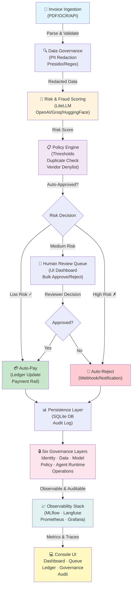
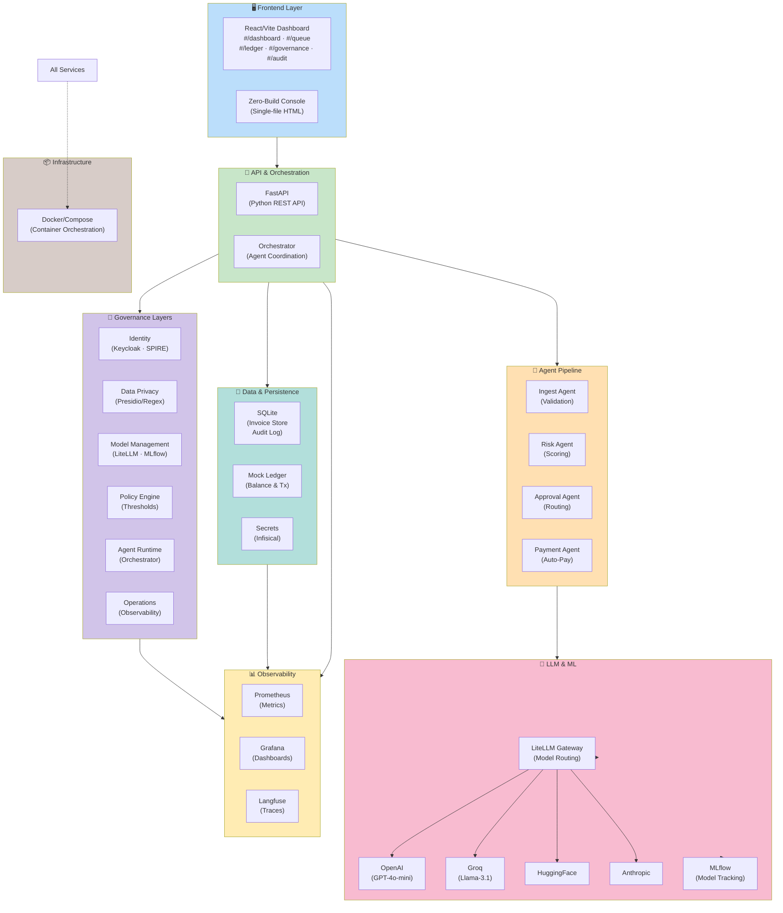

# Custodian AP - End-to-End Flow & Technology Stack

## System Flow Diagram



## Technology Stack by Layer



## Key Technologies Summary

| Category | Tools | Purpose |
|----------|-------|---------|
| **Frontend** | React/Vite, HTML/CSS/JavaScript | 5-section console UI with live data |
| **Backend** | FastAPI (Python) | REST API, request routing, orchestration |
| **AI/ML** | LiteLLM, MLflow | LLM gateway, multi-provider routing, model tracking |
| **Agents** | Custom Python modules | Invoice intake → risk scoring → approval → payment |
| **Governance** | Presidio, Keycloak, SPIRE | PII redaction, identity/auth, policy enforcement |
| **Database** | SQLite | Invoice persistence, audit trail (append-only) |
| **Observability** | Prometheus, Grafana, Langfuse | Metrics, dashboards, distributed tracing |
| **Secrets** | Infisical | Encrypted API key management |
| **Runtime** | Docker, Docker Compose | Container orchestration |
| **Notifications** | Webhooks, JSONL logs | Event notifications for rejections/alerts |

## Invoice Processing Journey

```
Invoice Input (PDF/OCR/API)
    ↓
[Data: PII Redaction] → Remove sensitive data
    ↓
[Model: LLM Scoring] → Risk/Fraud assessment (0-100)
    ↓
[Policy: Rule Engine] → Apply thresholds & hard limits
    ↓
Decision Tree:
├─ Risk < Auto-Approve Threshold → [Agent: Auto-Pay] → Ledger Update
├─ Risk Between Thresholds → [Human Review Queue] → Reviewer Decision
└─ Risk > Auto-Reject Threshold → [Agent: Auto-Reject] → Notification
    ↓
[Operations: Audit Log] → Append immutable decision trail
    ↓
[Observability: MLflow/Langfuse/Prometheus] → Track metrics & traces
    ↓
Dashboard Update → Real-time UI refresh (8s polling)
```

---

Interview Description: 

Custodian is a Python-based accounts payable automation platform designed to ingests invoices, extract and validate data, score them for fraud/risk, enforce policy rules, and route decisions for approval or automated payment. The platform combines a FastAPI backend with a Vite/React frontend, SQLite persistence, LiteLLM-based multi-provider LLM access, and MLflow tracking to create an end-to-end AP workflow with governance and auditability.

At a high level, the system follows an invoice lifecycle: OCR or structured invoice submission enters the pipeline, sensitive fields are redacted through privacy controls, risk scoring is performed using LLMs or heuristic fallback, and policy checks determine whether the invoice is auto-approved, sent for human review, or rejected. Approved invoices are posted to a ledger and payment flow, while all major actions are logged in an append-only audit trail. This makes the system suitable for finance operations where traceability, compliance, and explainability are critical.

The repository also emphasizes governance layers across identity, data protection, model access, policy enforcement, agent runtime, and operations. It includes observability through Prometheus, Grafana, and Langfuse, along with support for Docker-based deployment and multi-stack infrastructure. 

---

This project demonstrates strong architectural thinking: AI orchestration, workflow automation, secure enterprise patterns, and production-style observability in a domain-specific business workflow.